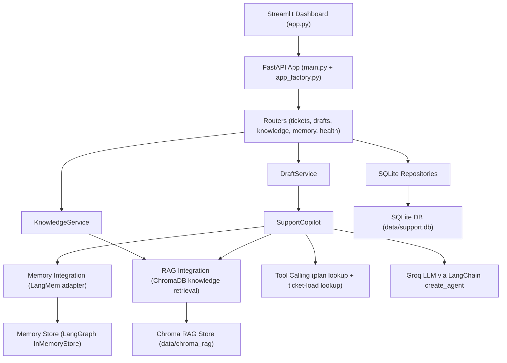
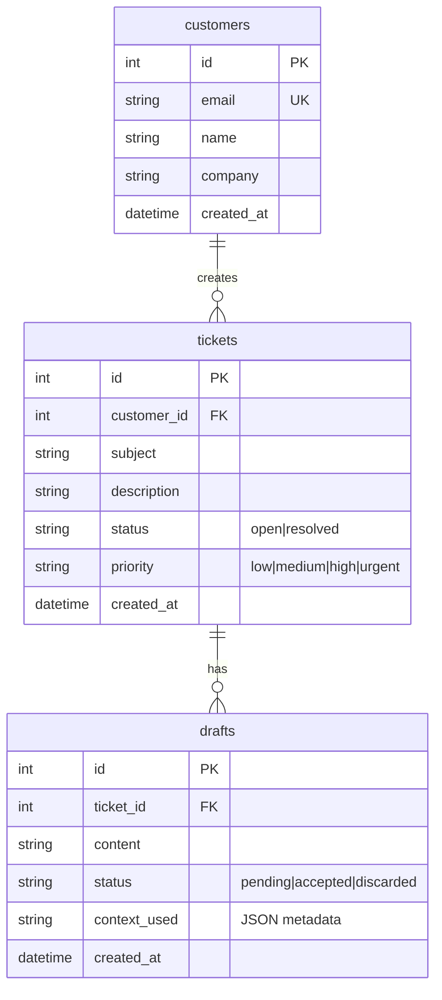

# 🛡️ Insurance Claims Copilot (AI-Powered Support Agent Assistant)

An advanced, production-ready AI copilot workbench built for insurance claims adjusters handling auto claims. The system accelerates claims operations by integrating customer historical interaction memory, policy guidelines (RAG), and live operational utility tools under an adjuster-approved, human-in-the-loop workflow.

---

## 📖 Table of Contents
1. [Overview](#-overview)
2. [Key Features](#-key-features)
3. [System Architecture](#%EF%B8%8F-system-architecture)
4. [Tech Stack](#-tech-stack)
5. [Codebase Map](#-codebase-map)
6. [Data Model & Persistence](#-data-model--persistence)
7. [AI, Memory, and RAG Specifications](#-ai-memory-and-rag-specifications)
8. [API Endpoints](#-api-endpoints)
9. [Streamlit Dashboard Guide](#-streamlit-dashboard-guide)
10. [Local Quickstart](#-local-quickstart)
11. [Docker Deployment](#-docker-deployment)
12. [CI/CD & AWS EC2 Deployment](#-cicd--aws-ec2-deployment)
13. [Testing](#-testing)

---

## 🔍 Overview

Managing First Notice of Loss (FNOL) and auto claim coverage validation is historically slow, manual, and prone to inconsistent application of policy guidelines. 

The **Insurance Claims Copilot** solves this by:
*   **Contextual RAG Retrieval:** Querying a ChromaDB vector database populated with policy documents and FAQs to fetch exact coverage rules.
*   **Customer & Company Memory:** Using a LangMem memory adapter backed by a LangGraph checkpointer and semantic memory indexing to recall past customer resolutions.
*   **Real-time Tool Calls:** Determining customer plan tiers, SLAs, and active support ticket loads dynamically during generation.
*   **Human-in-the-Loop Safety:** Synthesizing an editable, detailed coverage recommendation for adjusters to review, modify, approve, or discard.
*   **Feedback Loops:** Saving finalized claim resolutions back into long-term customer/company memory scopes, improving future generation consistency.

---

## ✨ Key Features

*   **FNOL Auto-Ingestion:** Streamlined portal to ingest claim particulars (e.g., claimant, policy number, loss location, incident date, estimated loss, and narrative description).
*   **Dynamic Context Tracing:** Comprehensive audit trails detailing which policy source files, tool outputs, and memory hits were used to generate each AI recommendation.
*   **Multi-Scope Memory:** Keeps customer-level and company-level context isolated and searchable, resolving queries like "Has Acme Logistics filed similar theft claims before?".
*   **Robust Fallbacks:** Implements multiple levels of backup logic (e.g., fallback prompt synthesis, deterministic script-based templates) to guarantee responses even when primary LLM tool calls fail or when API limits are hit.
*   **Production Deployment Ready:** Multi-container dockerization, automated unit/smoke test suite, and a fully configured GitHub Actions workflow for zero-downtime SSH deployment to AWS EC2.

---

## 🛠️ System Architecture

### High-Level Components



### Runtime Request Flow

1.  **FNOL Intake:** Adjuster submits or selects a claim in the [app.py](app.py) Streamlit UI.
2.  **FastAPI Route Trigger:** The UI communicates with FastAPI routers configured via [app_factory.py](customer_support_agent/api/app_factory.py).
3.  **Copilot Orchestration:** The backend triggers [copilot_service.py](customer_support_agent/services/copilot_service.py), retrieving semantic memories, querying ChromaDB ([chroma_kb.py](customer_support_agent/integrations/rag/chroma_kb.py)) for RAG context, and executing utility tools ([support_tools.py](customer_support_agent/integrations/tools/support_tools.py)).
4.  **Agent Invocation:** An orchestrated LangChain agent calls the Groq Llama-3.1 LLM.
5.  **Draft Preservation:** The resulting draft and tracing data are persisted to the SQLite database.
6.  **Adjuster Review:** The adjuster edits and approves the draft. This marks the ticket status as `resolved` and pushes the updated resolution back into the customer/company memory partition.

---

## 💻 Tech Stack

*   **Programming Language:** Python 3.11
*   **Web Framework:** FastAPI + Uvicorn
*   **Orchestration:** LangChain (`create_agent`) & LangGraph Checkpointer (`InMemorySaver`)
*   **LLM Engine:** Groq API (`llama-3.1-8b-instant`) via `langchain-groq`
*   **Embeddings & Vector Store:** Google GenAI (`gemini-embedding-001`) & ChromaDB
*   **Memory Layer:** LangMem adapter built on LangGraph's `InMemoryStore`
*   **Database:** SQLite (Relational Operational Store)
*   **Frontend Dashboard:** Streamlit
*   **Package Management:** `uv` (Astral's high-performance python package installer)
*   **Testing:** Pytest
*   **DevOps:** Docker, Docker Compose, GitHub Actions, AWS EC2

---

## 📁 Codebase Map

Below is a summary of key files and directories across the project:

```text
├── .github/workflows/          # CI/CD pipelines
│   ├── ci.yaml                 # Formats, linters, and Pytest runner
│   └── deploy-ec2.yaml         # Automatically builds, uploads, and deploys to AWS EC2
├── customer_support_agent/
│   ├── api/
│   │   ├── app_factory.py      # App bootstrap and CORS setups
│   │   ├── dependencies.py     # Endpoint injection (e.g. database and copilot services)
│   │   └── routers/            # Routing endpoints
│   │       ├── health.py       # Container readiness probes
│   │       ├── tickets.py      # FNOL registration & list operations
│   │       ├── drafts.py       # Recommendation generation & status updates
│   │       ├── knowledge.py    # Policy knowledge base ingestion
│   │       └── memory.py       # Customer memory list & search endpoints
│   ├── core/
│   │   └── settings.py         # Pydantic Settings config, resolving paths and defaults
│   ├── integrations/
│   │   ├── memory/
│   │   │   └── langmem_store.py# Customer memory manager with fallback persistence
│   │   ├── rag/
│   │   │   └── chroma_kb.py    # Vector RAG client for ingest and similarity query
│   │   └── tools/
│   │       └── support_tools.py# Custom LangChain tools (SLA lookups and user loads)
│   ├── repositories/
│   │   └── sqlite/             # SQLite CRUD services for tickets, customers, drafts
│   ├── schemas/
│   │   └── api.py              # Pydantic contract validation schemas
│   └── services/
│       ├── copilot_service.py  # Primary agent orchestration (memory + RAG + tools + LLM)
│       └── draft_service.py    # Operations on drafts and memory synchronization
├── data/                       # Operational databases (SQLite, Chroma directories)
├── docs/                       # Project reports, EC2 runbooks, and assignments
├── knowledge_base/             # Ingestible policy guides, regulations, and FAQs (.md, .txt)
├── app.py                      # Streamlit UI dashboard
├── main.py                     # Entrypoint starting Uvicorn server
├── pyproject.toml              # Dependencies and uv config
└── docker-compose.yml          # Multi-container orchestration configurations
```

*   **Configuration:** [settings.py](customer_support_agent/core/settings.py)
*   **Backend Orchestrator:** [main.py](main.py)
*   **Orchestration Logic:** [copilot_service.py](customer_support_agent/services/copilot_service.py)
*   **Custom Tools:** [support_tools.py](customer_support_agent/integrations/tools/support_tools.py)
*   **Frontend Interface:** [app.py](app.py)

---

## 🗄️ Data Model & Persistence

The project stores persistent data in `data/support.db` (SQLite relational store) and utilizes ChromaDB directories for memory and knowledge storage.

### SQLite Schema Summary
*   **`customers`**: Stores profile information (email, name, company).
*   **`tickets`**: Tracks individual registered auto claims, severity status, and descriptions.
*   **`drafts`**: Stores generated AI recommendations, audit logs (`context_used`), and adjuster statuses (`pending`, `accepted`, `discarded`).



---

## 🧠 AI, Memory, and RAG Specifications

### 1. Memory Layer (`CustomerMemoryStore`)
*   Defined in [langmem_store.py](customer_support_agent/integrations/memory/langmem_store.py).
*   **Scope Isolation:**
    *   **Customer Scope:** Partitioned by the user's lowercase email.
    *   **Company Scope:** Partitioned using the company prefix (e.g., `company::<slug>`).
*   **Semantic Indexing:** If `GOOGLE_API_KEY` is provided, memories are indexed using Google's embedding model for fast similarity search.
*   **Deterministic Fallback:** A local UUID-based `InMemoryStore` fallback operates automatically if embedding initialization fails or API keys are missing.

### 2. Retrieval-Augmented Generation (RAG)
*   Defined in [chroma_kb.py](customer_support_agent/integrations/rag/chroma_kb.py).
*   Scrapes policy documents, checks markdown files, splits them using `RecursiveCharacterTextSplitter` (configured for a default size of `800` characters with a `120` character overlap), and writes vectors into `data/chroma_rag`.

### 3. Agent Tool Calling
*   Exposes tools defined in [support_tools.py](customer_support_agent/integrations/tools/support_tools.py) to the LangChain agent context:
    *   `lookup_customer_plan`: Fetches customer SLA tiers (`free`, `starter`, `pro`, `enterprise`).
    *   `lookup_open_ticket_load`: Returns the current number of active open tickets for the customer email to help gauge claim impact.

---

## 🔌 API Endpoints

### 🩺 Health Check
*   `GET /health`
    *   **Response:** `{"status": "ok"}`

### 🎟️ Tickets Router
*   `GET /api/tickets`
    *   **Response:** `list[TicketResponse]`
*   `POST /api/tickets`
    *   Registers a claim, creates/fetches customer records, and optionally triggers a background recommendation draft.
    *   **Request Body:** `TicketCreate`
*   `GET /api/tickets/{ticket_id}`
    *   **Response:** `TicketResponse`
*   `POST /api/tickets/{ticket_id}/generate-draft`
    *   Manually generates/regenerates a recommendation draft for a claim.

### 📝 Drafts Router
*   `GET /api/drafts/{ticket_id}`
    *   Fetches the latest recommendation draft.
*   `PATCH /api/drafts/{draft_id}`
    *   Updates draft text content and switches status (`pending`, `accepted`, `discarded`).
    *   > [!IMPORTANT]
    *   > Updating to `accepted` changes the associated claim status to `resolved` and pushes the final approved resolution back to both customer and company memory stores.

### 📚 Knowledge Ingest Router
*   `POST /api/knowledge/ingest`
    *   Indexes files from the `knowledge_base` folder into ChromaDB.
    *   **Request Body:** `{"clear_existing": false}`

### 🧠 Customer Memory Router
*   `GET /api/customers/{customer_id}/memories`
    *   Lists all long-term memory logs associated with the customer.
*   `GET /api/customers/{customer_id}/memory-search`
    *   Performs similarity search over memories using query terms.

---

## 📊 Streamlit Dashboard Guide

Run the Streamlit frontend UI ([app.py](app.py)) to access the Claim Workbench tabs:

### 1. Register Claim (FNOL)
*   Fill in claimant particulars, loss descriptions, location details, policy identifiers, and estimated damage.
*   Optional check box: **Auto-generate coverage recommendation** (triggers backend draft generation instantly).

### 2. Claims Panel
*   **Select a Claim:** A dropdown menu lists all current tickets showing claimant details, severity, status, and narrative descriptions.
*   **Coverage Recommendation Section:**
    *   View the generated AI text recommendation in an editable text box.
    *   Adjusters can directly tweak the text block and click **Approve Recommendation** (saves memory and closes ticket) or **Request Info** (discards draft).
*   **Audit Context Expander:** Shows a visualization of decision inputs (KPI metrics, policy files hit, and tool execution logs).
*   **Claim History Probe:** Query input box to search past memory records semantically.

---

## 🚀 Local Quickstart

### Prerequisites
*   Python 3.11 installed
*   [uv](https://github.com/astral-sh/uv) package manager installed
*   A Groq API Key and a Google GenAI Developer Key

### 1. Environment Setup
Create a `.env` file in the root directory:
```bash
GROQ_API_KEY="your_groq_api_key"
GOOGLE_API_KEY="your_google_api_key"
API_BASE_URL="http://localhost:8000"
```

### 2. Syncing Environment
Installs all dependencies into a local virtual environment:
```bash
uv sync --dev
```

### 3. Running Services
Start the FastAPI backend server:
```bash
uv run python main.py
```
*API docs will be available at [http://localhost:8000/docs](http://localhost:8000/docs).*

In a separate terminal, launch the Streamlit frontend dashboard:
```bash
uv run streamlit run app.py
```
*The dashboard will be available at [http://localhost:8501](http://localhost:8501).*

---

## 🐳 Docker Deployment

The application is fully containerized. A shared docker volume keeps SQLite and vector DB files persisted locally in the `./data` folder.

To spin up the system (both API and dashboard) in containerized mode:
```bash
# Build and run containers
docker compose up -d --build

# Verify that containers are running and healthy
docker compose ps
```

*   **API Service:** Exposed on port `8000`
*   **Dashboard Service:** Exposed on port `8501`

To stop and remove containers:
```bash
docker compose down --remove-orphans
```

---

## 🌐 CI/CD & AWS EC2 Deployment

The project contains complete automated pipelines using GitHub Actions.

### CI Workflow ([ci.yaml](.github/workflows/ci.yaml))
Triggers on any PR or non-main push:
*   Sets up Python 3.11 and the `uv` environment.
*   Installs dependencies and runs testing suites using Pytest.

### CD Workflow ([deploy-ec2.yaml](.github/workflows/deploy-ec2.yaml))
Triggers on any push to the `main` branch:
1.  **Test Stage:** Validates formatting and code via Pytest.
2.  **Deployment Stage:**
    *   Establishes an SSH connection to the target EC2 instance.
    *   Compresses the code structure into a clean tarball (`release.tar.gz`), excluding dev virtual environments.
    *   Uploads the archive via `scp` to the remote server.
    *   Extracts files and runs `docker compose up -d --build --force-recreate`.
    *   Triggers API health checks at `/health` and monitors logs for confirmation.

### Required GitHub Secrets & Variables
Add the following credentials in the GitHub Repository settings (`Settings -> Secrets and variables -> Actions`):

| Name | Type | Description |
|---|---|---|
| `EC2_HOST` | **Secret** | Public IP address or DNS string of the EC2 Instance |
| `EC2_USER` | **Secret** | SSH Username (e.g. `ubuntu`) |
| `EC2_SSH_KEY` | **Secret** | Private SSH Key contents for access |
| `EC2_ENV_FILE` | **Secret** | Multi-line contents of the `.env` file |
| `INJECT_ENV_FILE` | **Variable** | Set to `true` to populate `.env` on target instance |

---

## 🧪 Testing

The repository has an automated testing suite utilizing `pytest` to verify RAG operations, ticket draft generation logic, and memory integrations:

To run tests locally:
```bash
uv run pytest -v
```

Tests include:
*   `test_draft_status_smoke.py`: Validates drafts and associated state-machine switches in SQLite.
*   `test_langmem_store.py`: Tests customer and company-level memory reads, insertions, and searches.
*   `test_simple.py`: Simple schema checks.

---

*Disclaimer: AI-generated coverage recommendations are support guidelines. Licensed human adjusters make final decisions on claim resolutions.*
